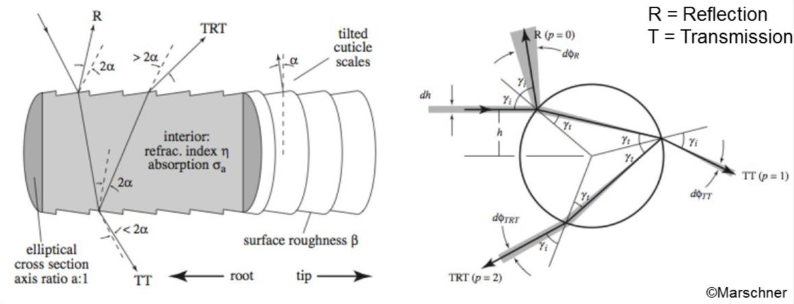
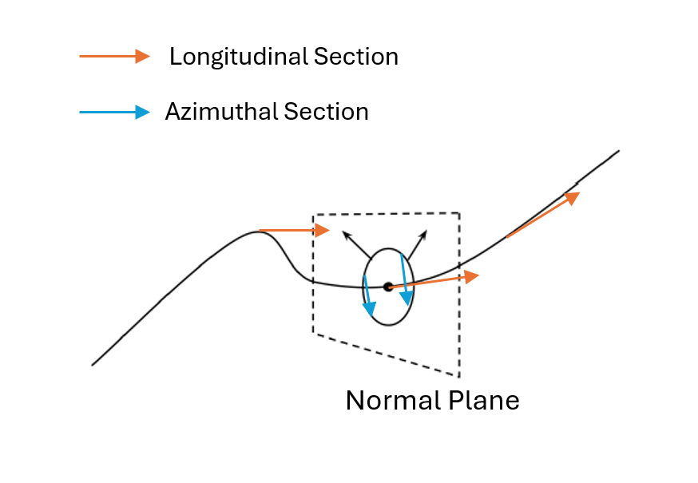

# RTXCR Hair Rendering Integration Guide

## Introduction



<p align="center">
    <em>Figure1: Marschner's 3 semi-separable lobe model.</em>
</p>


RTXCR SDK inplemented 2 strand-based hair BCSDF shading models, near-field `Chiang BCSDF` and a novel `Far-Field BCSDF`. Both model are based on the hair model by [Marschner03][Figure1], which breakdown the BCSDF into 3 semi-separable lobes `R`, `TT` and `TRT`, then the scattering result of three lobes are added together as final evaluation for the BCSDF.

`R` means the part of the rays that directly reflect back without enter into the volume of the hair.
`TT` means transmission + transmission, which is when the ray first refracts into the inside of the hair then refracts again on the other side of boundary of the volume to exit the hair curve.
`TRT` means transmission + reflection + transmission, which is the ray refracts into the hair but it reflects on the back of the hair so it stays inside of the hair volume. Then when it arrive the boundary again, it refracts out to leave the hair curve.



<p align="center">
    <em>Figure2: Strand-Based hair curve coordinate system. At any parametric point u along a Curve shape, the cross-section of the curve is defined by
        a circle. All of the circle’s surface normals at u (arrows) lie in a plane (dashed lines), dubbed the "normal plane".</em>
</p>


For every lobe, this hair model also splits up as a product between longitudinal direction contribution M and azimuthal direction contribution N. As shown in [Figure2], the longitudinal direction is defined as ∂p/∂u of curve coordination system, where p is the position of a point on the curve, u is the coordinate along the curve direction, perpendicular the to normal plane. The azimuthal direction is defined as ∂p/∂v on the normal plane, v is the coordinate around the outline of the curve on normal plane. 

So the final equation for the BCSDF is: `Fp(wo, wi) = M_R * N_R + M_TT * N_TT + M_TRT * N_TRT / cosθ`

### Near-Field and Far-Field

|              _Near-Field BCSDF_              |               _Far-Field BCSDF_              |
|:--------------------------------------------:|:--------------------------------------------:|
|             |          |

#### Near-Field Hair BCSDF
When an incident ray hits a hair/fur fiber, near-field scattering on the actual incident position, thus the actual azimuthal offset h is used to calculate the azimuthal part of BCSDF weight. The advantage of this method is the details on the azimuthal part is conserved, so we can see some highlights along the longitudinal direction with this method. However, this feature is subtle when the camera is not very close to the hair geometries, and cause lots of noise because of it's high frequency nature.

#### Far-Field Hair BCSDF
On contrast, far-Field model averange the energy to the entire azimuthal part without consider the exact azimuthal offset h. It may loses some details but in most cases the result is close to the near-field model because in most cases camera is not such close the hair/fur. Consider we render a human or an animal, it doesn't make sense to move camera such close to the hair/fur unless it's debugging by developers.

The advantage of this model is obvious: It has less noise and render similar quality as near-field model. For real-time path tracer, noise is already very severe problem and needs lots of effort to handle. Even if we have decent denoisers such as NRD/DLSS-RR, it always benefit to have a less noise original signal.

In addition, our new hair Far-Field BCSDF model optimizes approximation with multiple Gaussians to better match the Monte Carlo Simulation. Our rendering result clearly shows it better matches the ground truth compare to the Chiang BCSDF:

|         _Chiang BCSDF_       |   _Our New Far-Field BCSDF_   |         _Ground Truth_         |
|:----------------------------:|:-----------------------------:|:------------------------------:|
|  | ||

Our ground truth is modeled as mesh tubes with dielectric material. This model is based on observations of light refracting through human hair, captured using a USB microscope. [[Eugene24](elliptic_hair.pdf)]

## Integration

RTXCR SDK Hair Material Library is a library based on the shader instructions, which provides functions to evalute and sample the BCSDF. We also define the hair material to help developers easily integrate into their path tracer. We will show the actual steps and some sample code to provide a guidance on the integration:

### Step 1: Add RTXCR SDK Material Library as Submodule

    - git submodule add https://github.com/NVIDIA-RTX/RTXCR-Material-Library.git

### Step 2: Extend the material system

Add new hair material type in the material system of your path tracer and your tools which are provided to the artists.
Make sure to support all these required variables in HairMaterialData:

- `baseColor`: The color of the hair, only will be used when the absorption model is HairAbsorptionModel::Color
- `longitudinalRoughness`: Roughness on longitudinal direction
- `azimuthalRoughness`: Roughness on azimuthal direction
- `ior`: The index of refraction of the hair volume
- `eta`: 1 / ior
- `fresnelApproximation`: Flag that enable schlic fresnel approximation or not, set to true by default
- `absorptionModel`: Color based or physics based
- `melanin`: The melanin of the hair, 0 means no melanin, which makes the hair white; while 1 means maxium melanin, which makes hair black. Only will be used when the absorption model is HairAbsorptionModel::Physics or HairAbsorptionModel::Physics_Normalized
- `melaninRedness`; Control the redness of the hair. Only will be used when the absorption model is HairAbsorptionModel::Physics or HairAbsorptionModel::Physics_Normalized
- `cuticleAngleInDegrees`: The cuticle angle on top of the hair, the larger angle we have, the R and TRT highlight will be further away from each other. 0 means completely smooth hair on the cuticle.

### Step 3: Evaluate hair BCSDF for direct radiance

#### Step 3.1: Transfer to local coordiante system

All shadings are done in the local tangent coordiante system. So we need to transfer the view direction vector and light direction vector to tangent space:

```cpp
const float3x3 hairTangentBasis = float3x3(tangentWorld, biTangentWorld, shadingNormal); // TBN
const float3 viewVectorLocal = mul(hairTangentBasis, viewVector);
const float3 lightVectorLocal = mul(hairTangentBasis, vectorToLight);
```

#### Step 3.2: Setup HairInteractionSurface

Provide the incident ray direction, normal and tangent in tangent space:

```cpp
RTXCR_HairInteractionSurface hairInteractionSurface;
hairInteractionSurface.incidentRayDirection = viewVectorLocal;
hairInteractionSurface.shadingNormal = float3(0.0f, 0.0f, 1.0f);
hairInteractionSurface.tangent = float3(1.0f, 0.0f, 0.0f);
```

#### Step 3.3: Evaluate the BCSDF

Now we have all we need to evaluate the BCSDF, just simply create the `RTXCR_HairMaterialInteraction` for Chiang BCSDF or `RTXCR_HairMaterialInteractionBcsdf` for the noval Far-Field BCSDF. The "interaction" stores all the variables that needed for calculating the BCSDF, we seperate the Chiang and Far-Field because Chaing needs some pre-computation for the cuticle angel. Then we just send it with light and view direction to the `RTXCR_HairChiangBsdfEval` to get the final BCSDF result:

##### Chiang BCSDF:

```cpp
RTXCR_HairMaterialInteraction hairMaterialInteraction = RTXCR_CreateHairMaterialInteraction(hairMaterialData, hairInteractionSurface);
hairBsdf = RTXCR_HairChiangBsdfEval(hairMaterialInteraction, lightVectorLocal, viewVectorLocal);
```

##### Far-Field BCSDF:
The far-field version BCSDF optionally supports diffuse layer on top of the BCSDF lobe. So we need to send both hair roughness and diffuse tint to the evaluation function. If the game is not using diffuse layer, just send 0 to the evaluation function.

```cpp
RTXCR_HairMaterialInteractionBcsdf hairMaterialInteractionBcsdf = RTXCR_CreateHairMaterialInteractionBcsdf(hairMaterialData, g_Global.diffuseReflectionTint, g_Global.diffuseReflectionWeight, g_Global.hairRoughness);
RTXCR_HairFarFieldBcsdfEval(hairInteractionSurface, hairMaterialInteractionBcsdf, lightVectorLocal, viewVectorLocal, hairBsdf);
```

### Step 4: Evaluate hair BCSDF for indirect radiance

For indirect radiance, we first sample the BCSDF lobe to get indirect rays:

#### Chiang:
```cpp
RTXCR_HairLobeType lobeType;
RTXCR_HairMaterialInteraction hairMaterialInteraction = RTXCR_CreateHairMaterialInteraction(hairMaterialData, hairInteractionSurface);
continueTrace = RTXCR_SampleChiangBsdf(hairMaterialInteraction, viewVectorLocal, rand2, sampleDirection, bsdfPdf, bsdfWeight, lobeType);
```

#### Far-Field:
```cpp
const RTXCR_HairMaterialInteractionBcsdf hairMaterialInteractionBcsdf =
    RTXCR_CreateHairMaterialInteractionBcsdf(hairMaterialData, g_Global.diffuseReflectionTint, g_Global.diffuseReflectionWeight, g_Global.hairRoughness);
const float h = 2.0f * Rand(rngState) - 1.0f;
const float lobeRandom = Rand(rngState);
float3 bsdfSpecular = float3(0.0f, 0.0f, 0.0f);
float3 bsdfDiffuse = float3(0.0f, 0.0f, 0.0f);
continueTrace = RTXCR_SampleFarFieldBcsdf(hairInteractionSurface, hairMaterialInteractionBcsdf, viewVectorLocal, h, lobeRandom, rand2, sampleDirection, bsdfSpecular, bsdfDiffuse, bsdfPdf);
bsdfWeight = bsdfSpecular + bsdfDiffuse;
```

Then calculate the sample PDF and do integration:

```cpp
if (!continueTrace)
{
  return false;
}

bsdfWeight /= bsdfPdf;
throughput *= bsdfWeight;
```

## Reference
[1] A practical and controllable hair and fur model for production path tracing, MJY Chiang, B Bitterli, C Tappan, B Burley, Computer Graphics Forum 35 (2), 275-283 [Paper Link](https://benedikt-bitterli.me/pchfm/)

[2] THE IMPLEMENTATION OF A HAIR SCATTERING MODEL, Matt Pharr | [Paper Link](https://www.pbrt.org/hair.pdf)

[3] Physically based hair shading in unreal, Brian Karis | [Paper Link](https://blog.selfshadow.com/publications/s2016-shading-course/karis/s2016_pbs_epic_hair.pdf)

[4] Strand based Hair Rendering in Frostbite, Sebastian Tafuri | [Paper Link](https://advances.realtimerendering.com/s2019/hair_presentation_final.pdf)

[5] An efficient and practical near and far field fur reflectance model, LQ Yan, HW Jensen, R Ramamoorthi, ACM Transactions on Graphics (TOG) 36 (4), 1-13 | [Paper Link](https://dl.acm.org/doi/pdf/10.1145/3072959.3073600)

[6] A new hair BCSDF for real-time rendering, Eugene d'Eon | [Paper Link](elliptic_hair.pdf)
