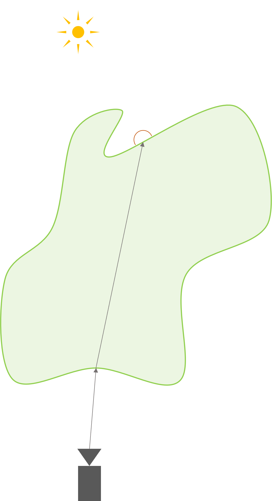

# RTX Character Rendering Subsurface Scattering Rendering Integration Guide

## Introduction

Evaluating subsurface scattering requires integrating over the entire surface of the geometry, which typically involves Monte Carlo integration with a random walk algorithm. This method is very time-consuming and unsuitable for real-time rendering. [ [Burley15] ] provides a good approximation for the full multiple scattering process with a cheaper, radius-based solution called a diffusion profile. Diffusion profile-based subsurface scattering is widely used in state-of-the-art real-time SSS solutions. Using Burley diffusion profile as an example, it is created based on search light configuration, which shoots a light beam into a semi-infinite thick flat surface and perform Monte Carlo random walk. After that we measure the distribution of how much light comes out relative to the distance from the entrance point of the light beam. Finally, we create some functions to approximate such a dataset and the function is what we call a diffusion profile.

However, the diffusion profile doesn't work well when the assumption of the search light configuration is broken. This means the volume is not semi-infinite anymore or it's not flat surface, such as the thin geometries which is a common case for human ears.

<p align="center">
  
</p>

As we can see here, the diffusion profile misses many details that are essential to the asset's features.

To address this, we implemented a fully ray-traced SSS (RTSSS) solution using a combined approach: a diffusion profile to provide a cheap estimation of multiple scattering, and ray-traced single scattering to capture important light phenomena caused by geometry features.

### Diffusion Profile
We implement the diffusion profile for real-time evaluation in screen space.

### Single Scattering Transmission
In our implementation, we sample the integration using the following process:

First, according to the transmission BSDF, we select a direction. We currently handle only diffuse transmission, though specular transmission BSDF sampling is also possible.

Next, we trace a ray. Once it hits the other side of the geometry, we evaluate the transmission BSDF again to exit the volume. This whole path is called the boundary term in volume scattering.

Along the ray, we importance-sample the distance according to the volume coefficients and compute the single scattering contribution.

<p align="center">
  
</p>

## Integration

The RTX Character Rendering SDK SSS Material Library provides functions to evaluate and sample the BCSDF. We also define the SSS material to help developers easily integrate it into their path tracer. Below are the actual steps and sample code to guide integration:

### Step 1: Add RTX Character Rendering SDK Material Library as Submodule

    - git submodule add https://github.com/NVIDIA-RTX/RTXCR-Material-Library.git

### Step 2: Extend the material system

Add a new SSS material type to your path tracer and the artist-facing tools.
Make sure to support all required variables in 'RTXCR_SubsurfaceMaterialData':

- 'transmissionColor': Determines the base color of the SSS surface, it's similar to the diffuse albedo color for diffuse materials. This parameter can also be set with a texture map.
- 'scatteringColor': Determines the distance (mean free path) that light will be transported inside the SSS object for each color channel. Larger value will allow the corresponding color scattered further on the surface, it will look like a tail extends from the diffuse model.
- 'scale': A scale that controls the SSS intensity of the whole object.
- 'g' (Anisotropy): Determines the overall scattering direction of the volume phase function, the range is (-1, 1). When this value less then 0, it models backwards scattering. Vice versa, it models forward scattering when the value larger than 0. The volume is isotropic when this value is 0.

### Step 3: Evaluate Diffusion Profile

The SDK provides utility functions for the SSS algorithm. Developers can generate diffusion profile samples with either a camera-facing, screen-space kernel or a geometry-normal-facing world-space kernel. The SDK then importance-samples the diffusion profile, which can be combined with irradiance to compute the SSS response.

#### Step 3.1: Generate a Sample on Disk from SSS Library

The first step is generating a sample on the disk and the diffusion profile weight for the sample from SSS library:

```cpp
SubsurfaceSample subsurfaceSample; // SamplePosition and bssrdfWeight (diffusion profile weight)
RTXCR_EvalBurleyDiffusionProfile(subsurfaceMaterialData, subsurfaceInteraction, /* out */ subsurfaceSample)
```

#### Step 3.2: Sample Ray Generation in Engine

From the engine side, developers trace a ray or project to screen space to obtain a surface sample.

#### Step 3.3: Get Irradiance and Evaluate SSS (BSSRDF)

With sample geometry information and irradiance (cached or computed in real-time), we can evaluate the BSSRDF:

```cpp
const float cosThetaI = min(max(0.00001f, dot(sampleShadingNormal, lightVector)), 1.0f);
radiance += RTXCR_EvalBssrdf(subsurfaceSample, sampleLightRadiance, cosThetaI);
```

### Step 4: Evaluate SSS Transmission

#### Step 4.1: Refraction Sample Ray Generation

A primary ray from the camera hits the geometry, refracts according to the transmission BSDF, and exits on the other side. The default sampling method is cosine-weighted transmission hemisphere sampling:

```cpp
RTXCR_CalculateRefractionRay(subsurfaceInteraction, rand2);
```

Developers can replace this with customized sampling for specular transmission.

<p align="center">
  
</p>

#### Step 4.2: Single Scattering

To compute single scattering, we sample along the refraction ray according to the volume coefficients.

We first importance sample along the refraction ray:
```cpp
float T = RTXCR_SampleDistance(float random /* inout */ , float sigmaT)
```

The SDK provides utility functions to importance-sample the piecewise scattering distance function and the phase function:

```cpp
// Sample single scattering direction with HG (Henyey Greenstein) phase function
float3 dir = RTXCR_SampleDirectionHG(float2 random2 /* inout * /, float g, float3 wo)
```

Using the sampled direction, we trace the single scattering ray, get boundary surface normal `Ns`, `position`, and `HitT`, then perform light sampling:

```cpp
float scatteringDistance = T + HitT;
RTXCR_EvaluateSingleScattering(Li, Ns, scatteringDistance, sssMaterial);
```
<p align="center">
  
</p>


## Reference
[1] Approximate Reflectance Profiles for Efficient Subsurface Scattering. Per H. Christensen, B Burley.“An approximate reflectance profile for efficient subsurface scattering.” ACM SIGGRAPH (2015): 1-1 | [Paper Link](https://graphics.pixar.com/library/ApproxBSSRDF/paper.pdf)

[Burley15]: https://graphics.pixar.com/library/ApproxBSSRDF/paper.pdf